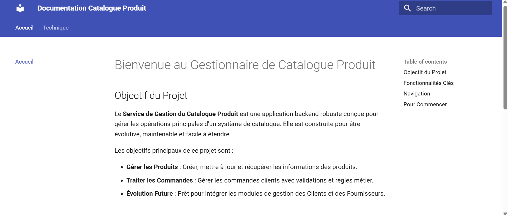

# Comment Lancer la Documentation

Ce guide explique comment compiler et visualiser cette documentation technique sur votre machine locale.

## Prérequis

Avant de commencer, assurez-vous d'avoir installé :

1.  **Python 3.x** : Nécessaire pour exécuter MkDocs.
2.  **PIP** : Le gestionnaire de paquets Python.

## Installation

Ouvrez votre terminal dans le dossier racine du projet et exécutez les commandes suivantes pour installer MkDocs et le thème Material :

```bash
pip install mkdocs-material
pip install mkdocs-material-extensions
```

## Lancement du Serveur

Une fois les dépendances installées, lancez le serveur de développement :

```bash
mkdocs serve
```

Vous devriez voir une sortie similaire à celle-ci dans votre terminal :


## Visualisation

Ouvrez votre navigateur web et accédez à l'adresse suivante :

[http://127.0.0.1:8000](http://127.0.0.1:8000)

Vous verrez alors la documentation rendue, comme illustré ci-dessous :



## Modifications

Le serveur `serve` supporte le rechargement à chaud (hot-reloading). Si vous modifiez un fichier `.md` dans le dossier `docs/`, la page se mettra à jour automatiquement dans votre navigateur.
