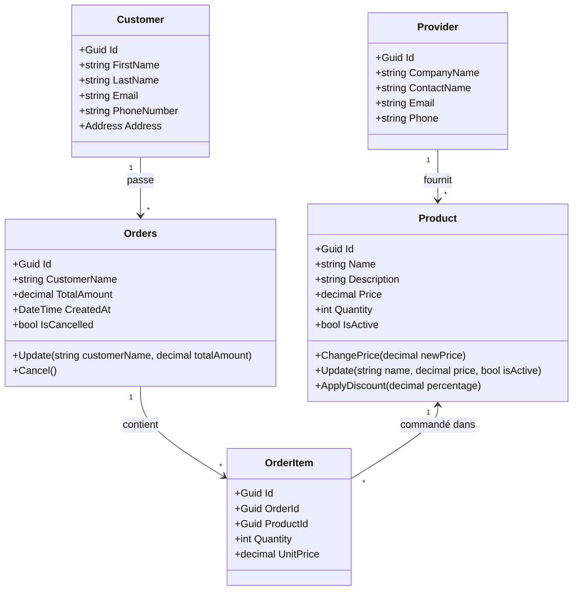

# Diagramme de Classes

Ce document illustre le modèle de domaine de l'application de Gestion de Catalogue Produit.

## Architecture Actuelle & Proposée

Le diagramme ci-dessous inclut les entités existantes (lignes pleines) et les entités proposées (lignes pointillées) pour répondre au besoin de gestion des Clients et Fournisseurs.

## Détails des Entités

### Entités Existantes

- **Product** : Représente un article du catalogue. Inclut la logique pour les changements de prix et remises.
- **Orders** : Représente une demande client. Stocke actuellement `CustomerName` comme chaîne, mais devrait lier une entité `Customer` à l'avenir.

### Entités Proposées

- **Customer** : Pour remplacer la simple chaîne `CustomerName` dans `Orders`, permettant une gestion complète des clients.
- **Provider (Fournisseur)** : Pour identifier la source des produits.
- **OrderItem** : Pour gérer plusieurs produits par commande (actuellement `Orders` a seulement un montant total, ce qui implique un modèle simplifié ou un détail manquant).
