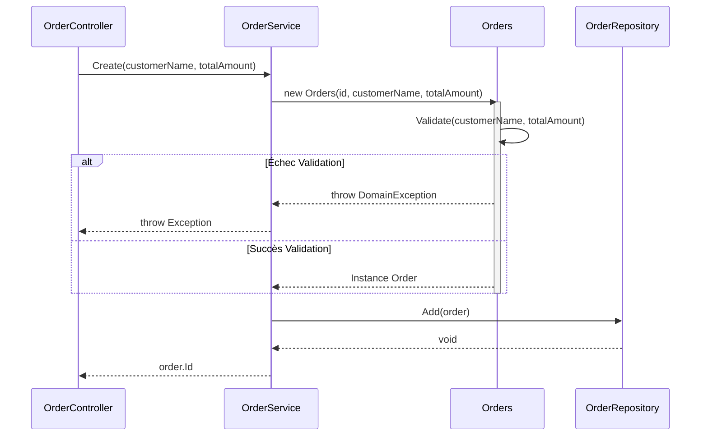
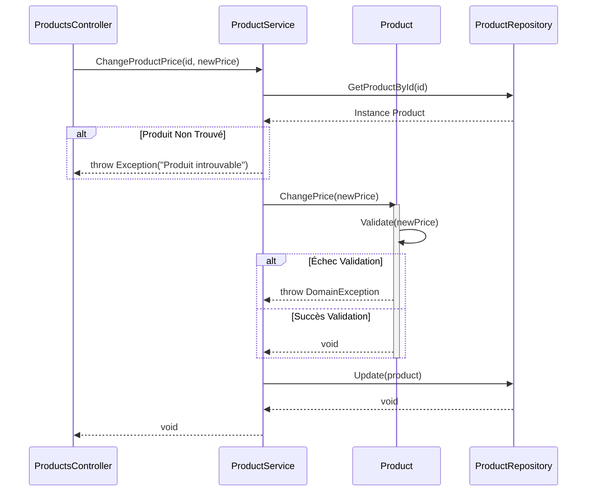

# Diagrammes de Flux

Ce document illustre les flux métier clés de l'application de Gestion de Catalogue Produit.

## 1. Flux de Création de Commande

Ce flux décrit le processus de création d'une nouvelle commande.

## 2. Flux de Mise à Jour de Prix Produit

Ce flux décrit le processus de mise à jour du prix d'un produit, en appliquant les règles métier (ex: prix positif).

